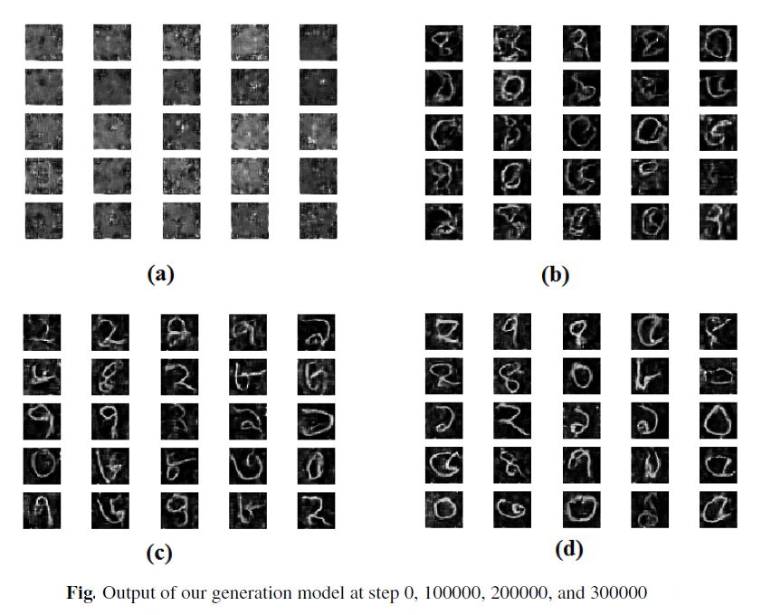

# Bangla Handwritten Digit Generation using Semi Supervised Generative Adversarial Network

Paper Title: <b>Bangla Handwritten Digit Recognition and Generation</b> \
Author: Md. Fahim Sikder \
Main Paper Link: [here](https://link.springer.com/chapter/10.1007%2F978-981-13-7564-4_46) also
anyone can read the preprint of the paper from [here](https://fahim-sikder.github.io/publication/digit-generate/).

Output:




## Citation

```
@inproceedings{sikder2020bangla,
  title={Bangla Handwritten Digit Recognition and Generation},
  author={Sikder, Md Fahim},
  booktitle={Proceedings of International Joint Conference on Computational Intelligence},
  pages={547--556},
  year={2020},
  organization={Springer}
}

```